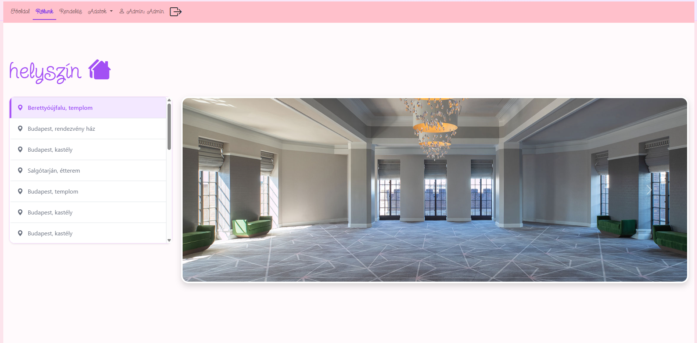
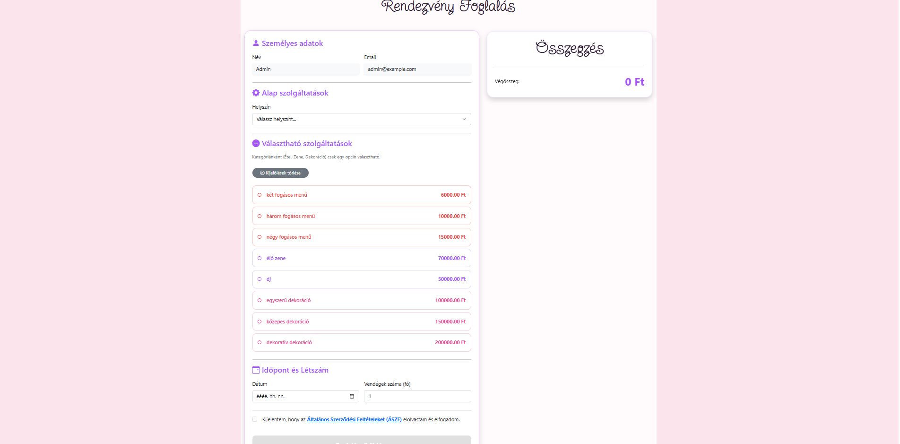

## 1. A projekt bemutatása
A vizsgaremek egy olyan szolgáltatást mutat be, amely lehetőséget ad különböző termek foglalására rendezvényekhez.  
A cél az, hogy a szervezők könnyen megtalálják a számukra megfelelő helyszínt, és egyszerűen le tudják adni a foglalási igényüket.

## 2. A szolgáltatás célja
A szolgáltatás célja, hogy:
- megkönnyítse a teremfoglalást,
- átlátható információt adjon a termekről,
- csökkentse a szervezéssel járó problémákat.

## A foglalás lépései:
1. A megfelelő terem kiválasztása.
2. Az időpont és a létszám megadása.
4. A foglalás visszaigazolása.

## 3. Projekt célja
A cél, hogy:
- nyilvántartsuk a vendégeket
- kezeljük a helyszíneket és időpontokat  
- költségvetést készítsünk  
- a programokat rendszerezzük  

## 4. A szolgáltatás előnyei
A szolgáltatás előnyei közé tartozik:
- egyszerű és gyors foglalás
- könnyen átlátható teremkínálat
- segítség a szervezésben
- rugalmas megoldások.


# A program szerkezete
## Jogkörök
- Admin
  - User kezelés (users)
  - Törzsadat kezelés
    - services tábla karbantartás (services)
    - helyszínek tábla karbantartás (locations)
- Felhasználó
  - Userhez fűződő feladatok
    - Login, logout
    - Profilkezelés
    - Regisztrálás
  - Rendelés: (orders)
    - Helyszínkiválasztás
    - Iőpont, létszám adatok megadása 
  - A rendeléshez kiválasztja a szolgáltatásokat (orderServices)
- Vendég
  - Tájékozódás:
    - Főldal
    - Rólunk

## Weboldalak
- Login, 
  - /login
  - LoginView
- Regisztráció
  - /registration
  - RegistrationView
- logout (nem oldal)
- profil
  - /userprofil
  - UserProfileView
- User kezelés
  - /adatok/users
  - UsersView
- Törzsadatok
  - Szolgáltatások
    - /adatok/szolgaltatasok
    - ServicesView
  - Helyszínek
    - /adatok/helyszinek
    - LocationsView
  - Rendelés
    - /rendeles
    - OrdersView
  - Főoldal
  - /adatok/about
  - AboutView

  ## 5. Használatának rövid bemutatása
(Ide illessz be képernyőképeket a futó programról)




  - Böngészés: A főoldalon a látogatók megtekinthetik a helyszíneket.

  - Foglalás: Regisztrált felhasználóként kiválasztható a helyszín, időpont és a kiegészítő szolgáltatások.

  - Adminisztráció: Az admin felületen kezelhetőek a felhasználók és a törzsadatok (helyszínek, árak).

## 6. Komponensek technikai leírása
Adatbázis:
  - Technológia: MySQL

  - Diagram: (Ide illessz be egy ER diagramot az adatbázisodról)

## Főbb táblák:

  - users: Felhasználók adatai és jogosultságai.

  - locations: Helyszínek adatai (város, cím, kapacitás, ár).

  - services: Rendelhető extra szolgáltatások (pl. zene, étel).

  - orders: Rendelések.

## Backend (Laravel)
Telepítés:

  - composer install

  - .env fájl beállítása (adatbázis kapcsolat)

  - php artisan migrate --seed

## Használt parancsok:

php artisan make:model -mcr (Modell, migráció és kontroller létrehozása)

php artisan migrate:fresh --seed (Adatbázis újrahúzása mintaadatokkal)

## Migráció példa (Locations)
```js
Schema::create('locations', function (Blueprint $table) {
   $table->id();
            $table->string('cityName',80);
            $table->string('zipCode', 5);
            $table->string('street', 125);
            $table->string('houseNumber', 10);
            $table->string('locationName', 80);
            $table->unique(['zipCode', 'street', 'houseNumber', 'locationName']);
            $table->integer('maxCapacity');
            $table->integer('minCapacity');
            $table->decimal('priceSlashPerson', 10,2);
            $table->decimal('roomPriceSlashDay', 10,2);
            $table->timestamps();
});
```
## Seeder példa (LocationSeeder)
  - A tesztadatokat Factory segítségével generáljuk:
```js
 public function run(): void
    { 
        Location::factory()->count(20)->create();
    }
```
## Controller minta (Locations)
```php
  public function update(Request $request, int $id) 
{
    return $this->apiResponse(function () use ($request, $id) {
        $row = CurrentModel::findOrFail($id);
        
        $row->update($request->all()); 
        
        return $row;
    });
}

```

## 7. Endpointok és Autentikáció
  - A rendszer a Laravel Sanctum könyvtárat használja token-alapú hitelesítésre.

  - Bejelentkezés: POST /api/users/login -> Visszaad egy Bearer Tokent.

  - Védett útvonalak: Az auth:sanctum middleware védi őket.

  - Jogosultságkezelés: A abilities middleware ellenőrzi a felhasználó szintjét (Admin vagy User).

  - Például : Metódus : GET	| Endpoint: /users |	Leírás: Felhasználók listázása |	Védelem: Admin

  ## 8. Frontend (Vue.js)
  - Belépési pont: main.js, App.vue

  - Állapotkezelés: Pinia (store) - itt tároljuk a bejelentkezett felhasználó adatait és a tokent.

  - Router: Vue Router kezeli az URL útvonalakat és a navigációs védelmet (Navigation Guards).

  - Komponensek:

  - views/: Teljes oldalak (LoginView, LocationsView).

  - components/: Újrafelhasználható elemek (Kártyák, Űrlapok).

  ## 9. Jogosultság ellenőrzése a Frontend oldalon:
  - A Menu.vue komponens a Pinia store adatait használva dönti el, mely menüpontok láthatóak az adott felhasználónak.
  ```js 
  hasMenuAccess(targetPath) {
  const userStore = useUserLoginLogoutStore();
  const resolved = this.$router.resolve(targetPath);
  return resolved.matched.every((route) => {
    const requiredRoles = route.meta?.roles;
    return userStore.canAccess(requiredRoles);
  });
  }```

## 10. View komponensek
  - LocationsView.vue
  - Ez a komponens felelős a helyszínek listázásáért, az új helyszín felvételéért, valamint a módosításért és törlésért.

  ```
  js
  <template>
  <div class="container py-4">
    <div class="d-flex align-items-center mb-4">
      <h1 class="m-0">{{ pageTitle }}</h1>
      <div class="ms-3 d-flex align-items-center">
        <i v-if="loading" class="bi bi-hourglass-split fs-3 text-primary me-2"></i>
        <span class="badge bg-secondary fs-6" v-if="items">{{ items.length }} db</span>
      </div>
    </div>
```

```
php
    <!-- Generikus táblázat a megjelenítéshez -->
    <GenericTable
      v-if="items && items.length > 0"
      :items="items"
      :columns="tableColumns"
      :useCollectionStore="useCollectionStore"
      :cButtonVisible="true" 
      :pButtonVisible="false"
      @delete="deleteHandler"
      > ```
 

  ## 11. Store és Service réteg
  - Service (api)
  - Az API hívásokért felelős réteg.

  ```js
  async create(data) {
  return await axios.post('/api/locations', data);
  } 
  ```
  ## Store (Pinia)
- Az adatok állapotát kezeli az alkalmazásban

```js 
async create(data) {
  this.loading = true;
  try {
    const response = await locationService.create(data);
    await this.getAll(); 
    return true;
  } catch (err) {
    this.error = err;
    return false;
  }
}
```
## 11. Összegzés
- Az adatokat a saját kódunkból gyűjtöttük, és segítséget is kértünk a tanártól. Ha el akadtunk, akkor néha a mesterséges intelligenciát is segítségül hívtuk.

 


