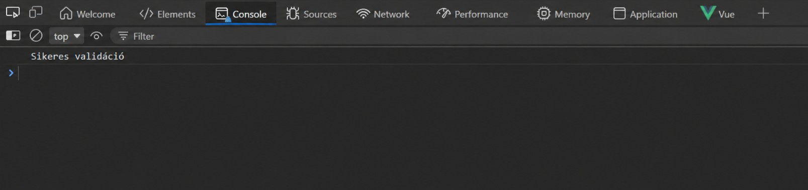

# Backend tesztek


## Request.rest szerkezete
```js
# @name login
POST {{host}}/api/users/login
Accept: application/json
Content-Type: application/json

{
    "email": "admin@example.com",
    "password": "123"
}

###
@token = {{login.response.body.data.token}}

### logout user
POST  {{host}}/api/users/logout
Accept: application/json
Authorization: Bearer {{token}}

### --- users
### get users
GET  {{host}}/api/users
Accept: application/json
Authorization: Bearer {{token}}

### get user by id
GET  {{host}}/api/users/1
Accept: application/json
Authorization: Bearer {{token}}

### post user
POST {{host}}/api/users 
Content-Type: application/json
Accept: application/json
Authorization: Bearer {{token}}

{
    "name":  "booker2",
    "email": "booker2@example.com",
    "password": "456"
}

### patch user
PATCH {{host}}/api/users/2
Content-Type: application/json
Accept: application/json
Authorization: Bearer {{token}}

{
    "name": "No Boss"
}

### delete user
DELETE {{host}}/api/users/2
Content-Type: application/json
Accept: application/json
Authorization: Bearer {{token}}

```

## Bejelentkezés
```js
### --- login
### login
# @name login
POST {{host}}/api/users/login
Accept: application/json
Content-Type: application/json

{
    "email": "admin@example.com",
    "password": "123"
}

###
@token = {{login.response.body.data.token}}

### logout user
POST  {{host}}/api/users/logout
Accept: application/json
Authorization: Bearer {{token}}


HTTP/1.1 200 OK
Host: localhost:8000
Connection: close
X-Powered-By: PHP/8.3.14
Cache-Control: no-cache, private
Date: Mon, 04 May 2026 06:51:37 GMT
Content-Type: application/json
Access-Control-Allow-Origin: *

{
  "message": "ok",
  "data": {
    "id": 1,
    "name": "Admin",
    "email": "admin@example.com",
    "role": 1,
    "idNumber": "JA748638",
    "city": "Budapest",
    "street": "Endre dűlőút",
    "houseNumber": "81",
    "postCode": "4066",
    "token": "2|oRLkRed5ZmJWr6nOXWJdtl7Os4Zj1uz6fUaF4pC862260fcf"
  }
}


```
## CRUD minta kód
```js

//Eredmény:
HTTP/1.1 200 OK
Host: localhost:8000
Connection: close
X-Powered-By: PHP/8.3.14
Cache-Control: no-cache, private
Date: Mon, 04 May 2026 06:50:14 GMT
Content-Type: application/json
Access-Control-Allow-Origin: *


  "message": "OK",
  "data": 
    {
      "id": 1,
      "name": "Admin",
      "email": "admin@example.com",
      "role": 1,
      "idNumber": "JA748638",
      "city": "Budapest",
      "street": "Endre dűlőút",
      "houseNumber": "81",
      "postCode": "4066"
    },
```
## Unit tesztek
```js
//Unit LocationTest.php
    public static function expectedSchemaDataProvider(): array
    {
        return [
            'id'                => ['id', 'bigint'],
            'cityName'          => ['cityName', 'varchar'],
            'zipCode'           => ['zipCode', 'varchar'],
            'street'            => ['street', 'varchar'],
            'houseNumber'       => ['houseNumber', 'varchar'],
            'locationName'      => ['locationName', 'varchar'],
            'maxCapacity'       => ['maxCapacity', 'int'],
            'minCapacity'       => ['minCapacity', 'int'],
            'priceSlashPerson'  => ['priceSlashPerson', 'decimal'],
            'roomPriceSlashDay' => ['roomPriceSlashDay', 'decimal'],
        ];
    }

    public function test_exists_locations_table(): void
    {
        $this->assertTrue(
            Schema::hasTable($this->table), 
            "A '{$this->table}' tábla nem létezik."
        );
    }
```

## Feature tesztek
```js
//Feature unit teszt minta:
//Feature PingTest.php
  public static function tablesGetDataProvider(): array
    {
        return [
            'get users admin: 200' => ['users', 'admin@example.com', '123', 200],
            'get locations admin: 200' => ['locations', 'admin@example.com', '123', 200],
            'get services admin: 200' => ['services', 'admin@example.com', '123', 200],
            'get orders admin: 200' => ['orders', 'admin@example.com', '123', 200],
            'get users booker: 403' => ['users', 'megrendelo@gmail.com', '456', 403],
            'get locations booker: 200' => ['locations', 'megrendelo@gmail.com', '456', 200],
        ];
    } 
    ```


# A tesztek végeredménye: 
```console
php artisan test --testdox-text test-results.txt
```

```txt
Database Service (Tests\Unit\DatabaseService)
 [x] Example
 [x] Exists all tables with data set "services tábla"
 [x] Exists all tables with data set "users tábla"
 [x] Exists all tables with data set "orders tábla"
 [x] Exists all tables with data set "order_services tábla"
 [x] Exists all tables with data set "locations tábla"
 [x] Exists all tables with data set "service_types"
 [x] Exists all tables with data set "locations_pictures"
 [x] Exists all tables with data set "pictures"

Event Api (Tests\Feature\EventApi)
 [x] Example

Example (Tests\Feature\Example)
 [x] The application returns a successful response
 [x] User login logout

Example (Tests\Unit\Example)
 [x] Location data integrity
 [x] Order belongs to user
 [x] Service type mapping
 [x] Pictures collection

Location (Tests\Unit\Location)
 [x] Exists locations table
 [x] Does the locations table contain all fields with data set "id"
 [x] Does the locations table contain all fields with data set "cityName"
 [x] Does the locations table contain all fields with data set "zipCode"
 [x] Does the locations table contain all fields with data set "street"
 [x] Does the locations table contain all fields with data set "houseNumber"
 [x] Does the locations table contain all fields with data set "locationName"
 [x] Does the locations table contain all fields with data set "maxCapacity"
 [x] Does the locations table contain all fields with data set "minCapacity"
 [x] Does the locations table contain all fields with data set "priceSlashPerson"
 [x] Does the locations table contain all fields with data set "roomPriceSlashDay"
 [x] The locations table columns have the expected types with data set "id"
 [x] The locations table columns have the expected types with data set "cityName"
 [x] The locations table columns have the expected types with data set "zipCode"
 [x] The locations table columns have the expected types with data set "street"
 [x] The locations table columns have the expected types with data set "houseNumber"
 [x] The locations table columns have the expected types with data set "locationName"
 [x] The locations table columns have the expected types with data set "maxCapacity"
 [x] The locations table columns have the expected types with data set "minCapacity"
 [x] The locations table columns have the expected types with data set "priceSlashPerson"
 [x] The locations table columns have the expected types with data set "roomPriceSlashDay"

Location Picture (Tests\Unit\LocationPicture)
 [x] Exists locations pictures table
 [x] Does the locations pictures table contain all fields with data set "id"
 [x] Does the locations pictures table contain all fields with data set "pictureId"
 [x] Does the locations pictures table contain all fields with data set "locationId"
 [x] The locations pictures table columns have the expected types with data set "id"
 [x] The locations pictures table columns have the expected types with data set "pictureId"
 [x] The locations pictures table columns have the expected types with data set "locationId"

Order (Tests\Unit\Order)
 [x] Exists orders table
 [x] Does the orders table contain all fields with data set "id"
 [x] Does the orders table contain all fields with data set "userId"
 [x] Does the orders table contain all fields with data set "locationId"
 [x] Does the orders table contain all fields with data set "howManyPeople"
 [x] Does the orders table contain all fields with data set "howManyDays"
 [x] Does the orders table contain all fields with data set "orderTime"
 [x] The orders table columns have the expected types with data set "id"
 [x] The orders table columns have the expected types with data set "userId"
 [x] The orders table columns have the expected types with data set "locationId"
 [x] The orders table columns have the expected types with data set "howManyPeople"
 [x] The orders table columns have the expected types with data set "howManyDays"
 [x] The orders table columns have the expected types with data set "orderTime"

Order Service (Tests\Unit\OrderService)
 [x] Exists order services table
 [x] Does the order services table contain all fields with data set "id"
 [x] Does the order services table contain all fields with data set "orderId"
 [x] Does the order services table contain all fields with data set "serviceId"
 [x] The order services table columns have the expected types with data set "id"
 [x] The order services table columns have the expected types with data set "orderId"
 [x] The order services table columns have the expected types with data set "serviceId"

Picture (Tests\Unit\Picture)
 [x] Exists pictures table
 [x] Does the pictures table contain all fields with data set "id"
 [x] Does the pictures table contain all fields with data set "pictureName"
 [x] Does the pictures table contain all fields with data set "serviceId"
 [x] The pictures table columns have the expected types with data set "id"
 [x] The pictures table columns have the expected types with data set "pictureName"
 [x] The pictures table columns have the expected types with data set "serviceId"

Ping (Tests\Feature\Ping)
 [x] Table user login get logout with data set "get users admin: 200"
 [x] Table user login get logout with data set "get locations admin: 200"
 [x] Table user login get logout with data set "get services admin: 200"
 [x] Table user login get logout with data set "get orders admin: 200"
 [x] Table user login get logout with data set "get users booker: 403"
 [x] Table user login get logout with data set "get locations booker: 200"
 [x] Table user login post delete logout with data set "post-delete locations admin"
 [x] Table user login post delete logout with data set "post-delete services admin"
 [x] Table user login post delete logout with data set "post-delete service_types admin"
 [x] Table user login post delete logout with data set "post-delete orders booker"
 [x] Table user login post delete logout with data set "post-delete locations booker"

Service (Tests\Unit\Service)
 [x] Exists services table
 [x] Does the services table contain all fields with data set "id"
 [x] Does the services table contain all fields with data set "service"
 [x] Does the services table contain all fields with data set "serviceTypeId"
 [x] Does the services table contain all fields with data set "price"
 [x] The services table columns have the expected types with data set "id"
 [x] The services table columns have the expected types with data set "service"
 [x] The services table columns have the expected types with data set "serviceTypeId"
 [x] The services table columns have the expected types with data set "price"

Service Type (Tests\Unit\ServiceType)
 [x] Exists service types table
 [x] Does the service types table contain all fields with data set "id"
 [x] Does the service types table contain all fields with data set "serviceTypeName"
 [x] The service types table columns have the expected types with data set "id"
 [x] The service types table columns have the expected types with data set "serviceTypeName"

User (Tests\Feature\User)
 [x] Example

User (Tests\Unit\User)
 [x] Exists users table
 [x] Does the user table contain all fields
 [x] The user table columns have the expected types
 [x] Check if users getting fetched with id
 [x] Users table record number
 [x] Does the user exist
 [x] A given password matches the users hashed password


```


# Frontend

## vitest
```js
import { fileURLToPath } from 'node:url'
import { mergeConfig, defineConfig, configDefaults } from 'vitest/config'
import viteConfig from './vite.config'

export default mergeConfig(
  viteConfig,
  defineConfig({
    test: {
      environment: 'jsdom',
      exclude: [...configDefaults.exclude, 'e2e/**'],
      root: fileURLToPath(new URL('./', import.meta.url)),
    },
  }),
)
```

## e2e teszt
```js
<?php

namespace Tests\Feature;

// use Illuminate\Foundation\Testing\RefreshDatabase;
use Tests\TestBase;

class ExampleTest extends TestBase
{
    /**
     * A basic test example.
     */
    public function test_the_application_returns_a_successful_response(): void
    {
        $response = $this->get('/api/x');
        //dd($response);
        $response->assertStatus(200);
        $response->assertSee('API');
    }

    public function test_user_login_logout()
    {
        //login admin
        $response = $this->login('admin@example.com', '123');
        $response->assertStatus(200);

        //token
        $token = $this->myGetToken($response);

        //get
        $uri = '/api/users';
        $response = $this->myGet($uri, $token);
        //2xx: minden oké
        //4xx: klienshiba
        //5xx: serverhiba
        // $response->assertStatus(403);
       //$response->assertSuccessful();
        //$response->assertClientError();
     $response->assertStatus(200);

        //logout
        $response = $this->logout($token);
        $response->assertStatus(200);


    }
}
```
## néhány mintakód és magyarázat


## teszt eredményének dokumentálása
A felhasználó regisztrál ami azt követi hogy át dobja a bejlentkezés oldalra ahol bejelentkezés követően bedobja az új felhasználót a profiljába.

